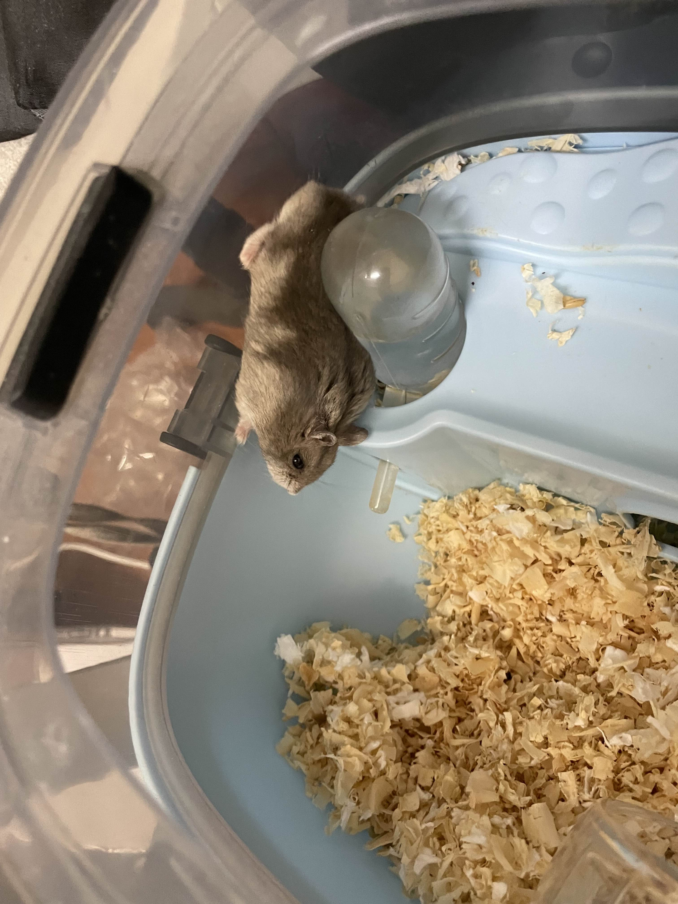

歡迎來到我的部落格ㄛ(❍ᴥ❍ʋ).
會放一些工作，學習，跟生活日記

## 自我簡介
- 興趣:羽球，健身，慢跑，瘋狂做菜
- 學歷:岸裡國小，神岡國中，台中高工，台科
- 工作經驗:工程師，端火鍋，

- 社團經驗:武術社，吉他社，熱舞社

## 勞贖
這是我養的老鼠，他的名字叫**勞贖**

 

* 出生日期:
  2024年2月
* 性別:
  男
* 品種:三線鼠
* 最愛吃的食物:向日葵種子
* 興趣:咬主人的手指咬到流血     
